# PokeMon（Gen1 - Gen7）数据分析

### 李畅 10225102463

## 0.背景介绍

作为游戏界经久不衰的IP，宝可梦系列一直是任天堂公司旗下最受欢迎的、最盈利的游戏系列之一。在本课题中，我将就第一世代到第七世代的宝可梦数据进行相关的数据分析。

### 数据集来源：https://www.kaggle.com/datasets/rounakbanik/pokemon/data

### 数据集内容描述

+ **name**: The English name of the Pokemon
+ **japanese_name**: The Original Japanese name of the Pokemon
+ **pokedex_number**: The entry number of the Pokemon in the National Pokedex
+ **percentage_male**: The percentage of the species that are male. Blank if the Pokemon is genderless.
+ **type1**: The Primary Type of the Pokemon
+ **type2**: The Secondary Type of the Pokemon
+ **classification**: The Classification of the Pokemon as described by the Sun and Moon Pokedex
+ **height_m**: Height of the Pokemon in metres
+ **weight_kg**: The Weight of the Pokemon in kilograms
+ **capture_rate**: Capture Rate of the Pokemon
+ **base_egg_steps**: The number of steps required to hatch an egg of the Pokemon
+ **abilities**: A stringified list of abilities that the Pokemon is capable of having
+ **experience_growth**: The Experience Growth of the Pokemon
+ **base_happiness**: Base Happiness of the Pokemon
+ **against_?**: Eighteen features that denote the amount of damage taken against an attack of a particular type
+ **hp**: The Base HP of the Pokemon
+ **attack**: The Base Attack of the Pokemon
+ **defense**: The Base Defense of the Pokemon
+ **sp_attack**: The Base Special Attack of the Pokemon
+ **sp_defense**: The Base Special Defense of the Pokemon
+ **speed**: The Base Speed of the Pokemon
+ **generation**: The numbered generation which the Pokemon was first introduced
+ **is_legendary**: Denotes if the Pokemon is legendary.

### 数据清理

```
fulldata = pd.read_csv('DataSets/pokemon_comp.csv')
col_against = fulldata.loc[:,fulldata.columns.str.contains('against_')]
df = fulldata.drop(col_against, axis=1)
```

数据集中的`against_?`表示了属性克制关系，对于本次数据分析缺少意义，因此去除。

## 1. Is a PokeMon Legendary?——能否根据数据判断宝可梦是否为传说级？

### 概述

在宝可梦世界观里，传说级宝可梦在剧情中扮演着重要角色，往往拥有强大力量且数量稀少。

### 直观分析

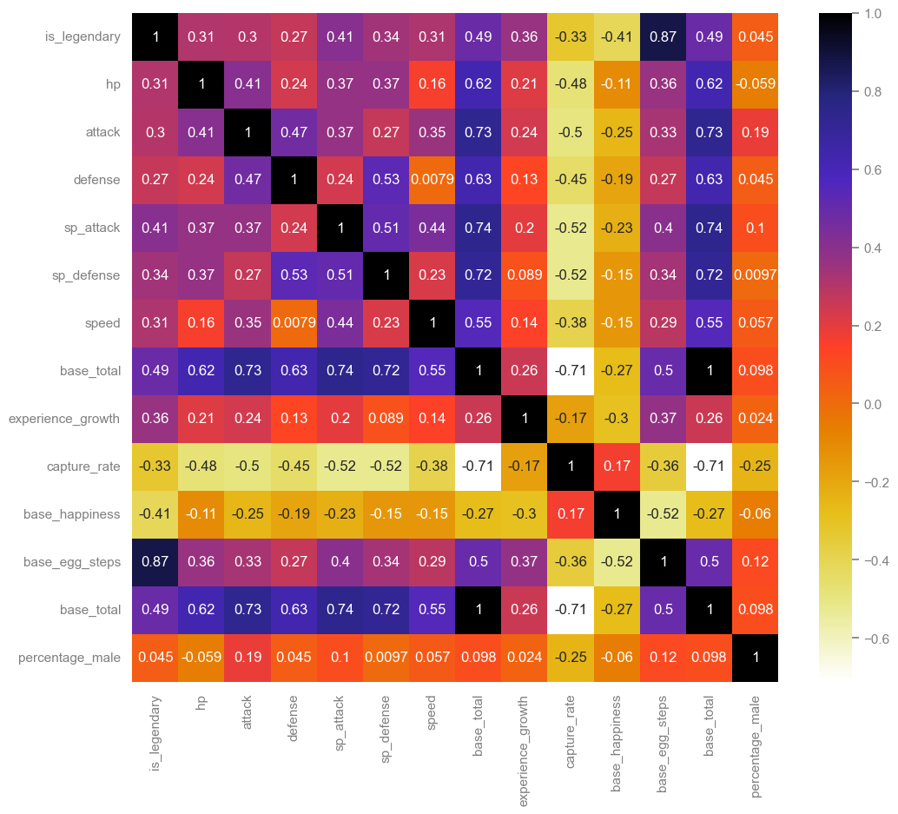

通过生成热力图，观察相关可量化指标，可以直观地看出各项数据与是否为传说宝可梦的关系。

令人惊奇的是，相关性最高的竟然是孵蛋所需步数。而直觉中，负相关性理应较高的捕获率却只有-0.33。

## 2. "Shape" and Base Status Relationship——宝可梦的体型与能力值的关系

### 概述

宝可梦的设定中有身高、体重两个数值描述体型，而能力值包括生命（HP）、攻击、防御、特攻、特防、速度六项指标。这一部分，我尝试性地分析了宝可梦的体型和能力值的关系。

**以体重与HP为例**

### 数据处理

```
missing_weight = df[df["weight_kg"].isna()]
missing_height = df[df["height_m"].isna()]
```

查询数据集，发现有部分数据缺失，如下图：

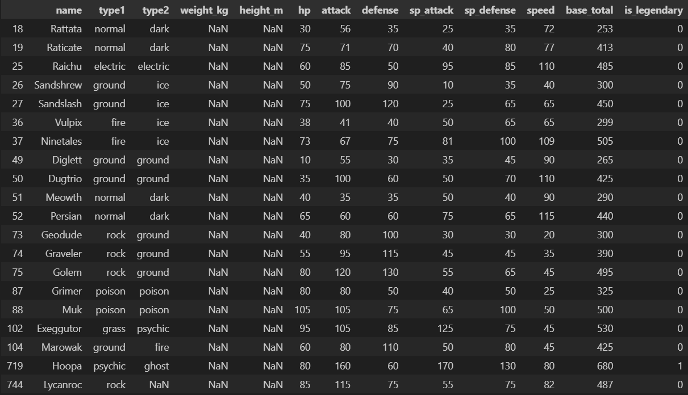

这部分很明显是数据集出错了，因此查询宝可梦wiki（https://wiki.52poke.com）并逐个补充。

绘制散点图：

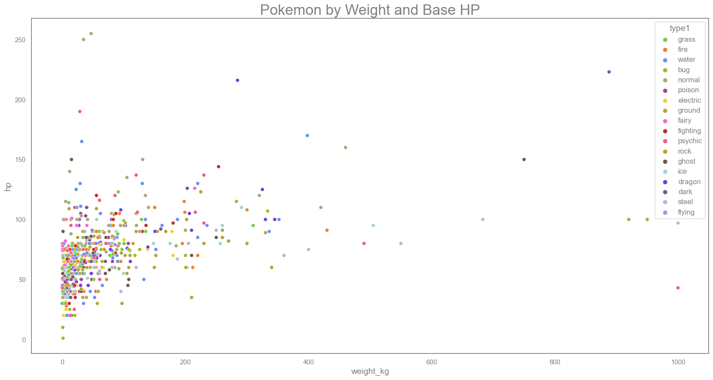

计算出相关系数为0.425。说明相关性较弱

然后我们发现，根据宝可梦属性（type）的不同，其相关系数也不相同：

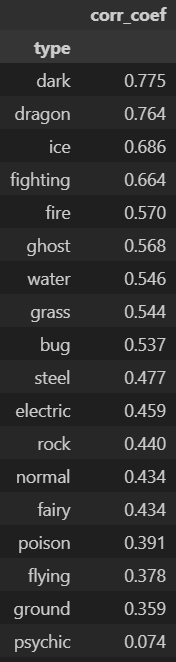

其中，毒、飞行、地面、超能四种属性宝可梦的体重-HP相关系数都低于平均值0.425。

统计各属性宝可梦数量：

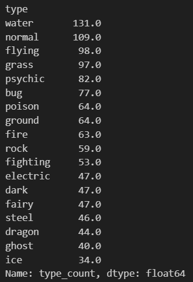

水属性宝可梦最多。结合两次统计，对数据加权处理。计算出加权后的相关系数为0.483。

### 初步统计

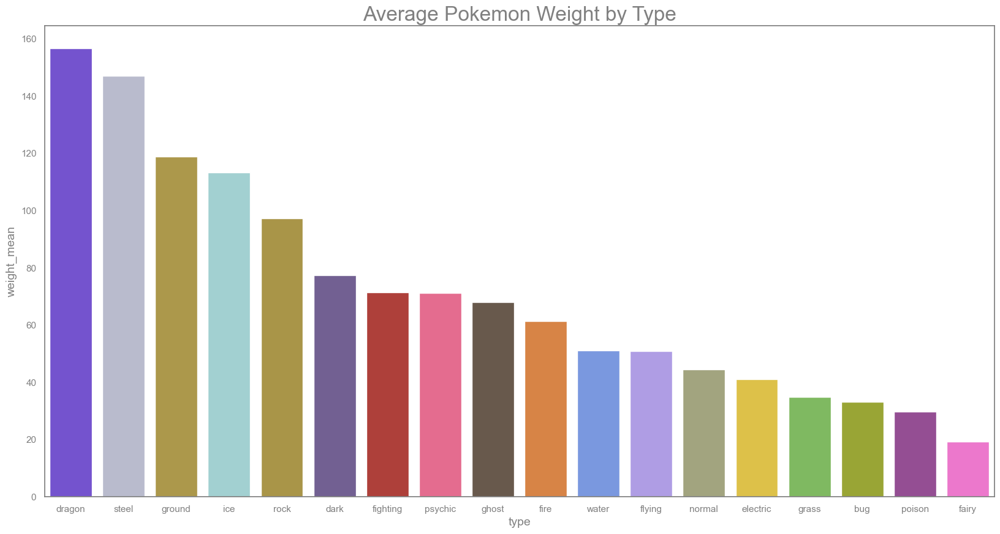

各属性的重量平均值

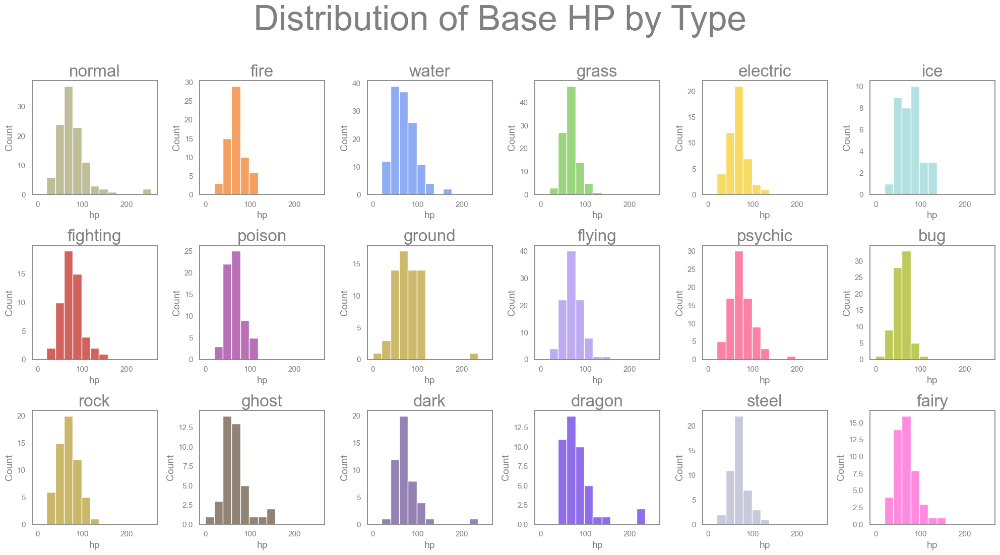

各属性的HP分布

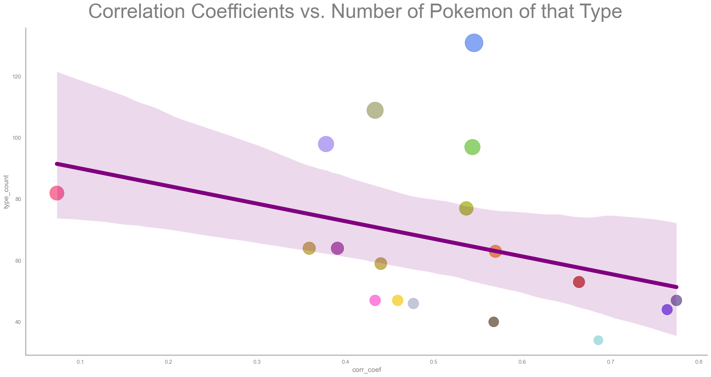

各属性宝可梦数量与相关系数的关系。拟合曲线是向下的，这表示，一个属性越稀有（宝可梦数量少），则体重-HP的相关性越强。这其实很合理，一个属性的宝可梦越多，则产生的特殊值越多（为了宝可梦的多样性）。

因此，我考虑到需要处理一些特别离谱的数值。

### 异常值处理

通过统计体重`weight_kg`和生命`hp`的最大值，考虑到各属性情况，结合马氏距离的计算，最终选出了前20个异常值。（具体过程见代码）

再次绘制散点图，并将异常值标记为红色点：

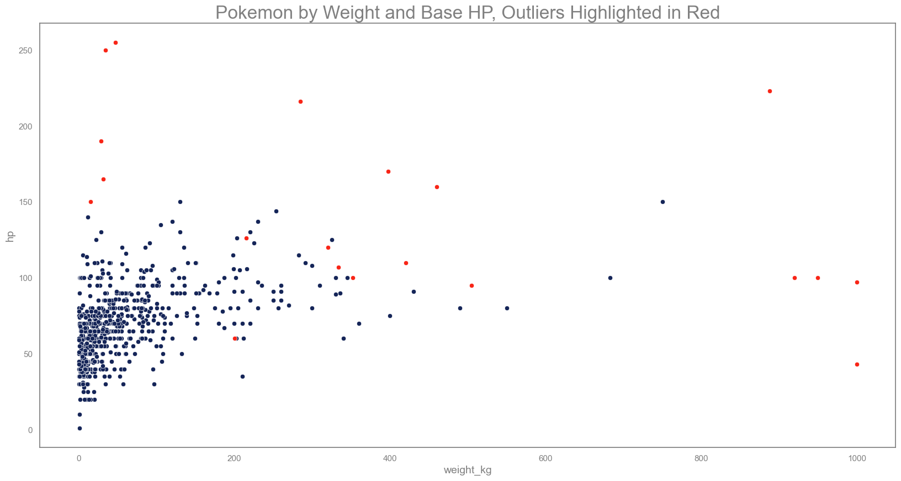

+ 大多数被标记为异常的宝可梦在体重/HP指标里只有一项是“异常”。
+ 考虑到体重和HP根据各属性的分布，有些看起来很高的值没有被标记为“异常”。

处理异常值后，再次绘制相关统计图。

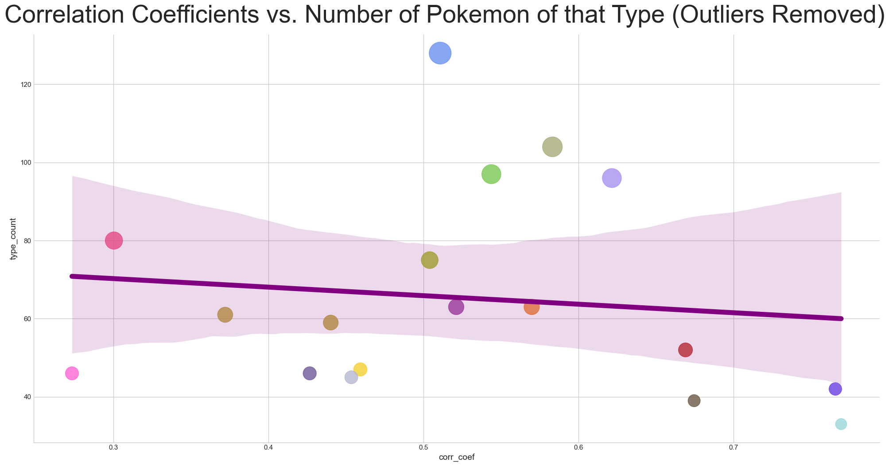

处理后的属性宝可梦数量与相关系数的关系。可以看出拟合曲线变得平缓，说明属性对于体重-HP相关性的影响变得微弱了。

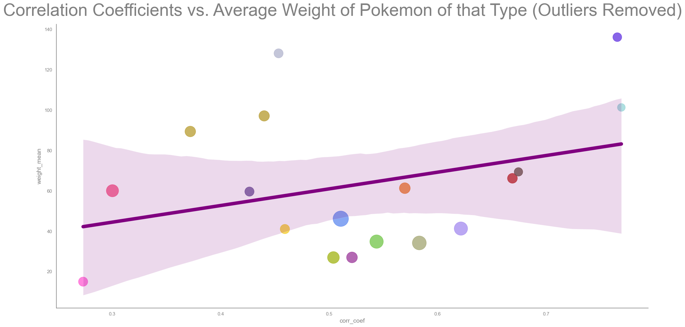

各属性宝可梦体重与相关系数的关系图，这说明平均体重越重的属性，相关性越强。考虑到宝可梦体重分布图里，大部分宝可梦都是较轻的，这也比较符合一般认识。

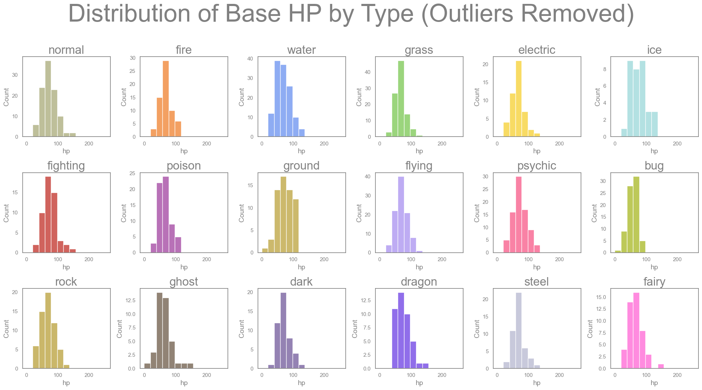

去除异常值后的各属性HP分布。

去除异常值后，各属性宝可梦的HP、体重的均值、标准差如下表：

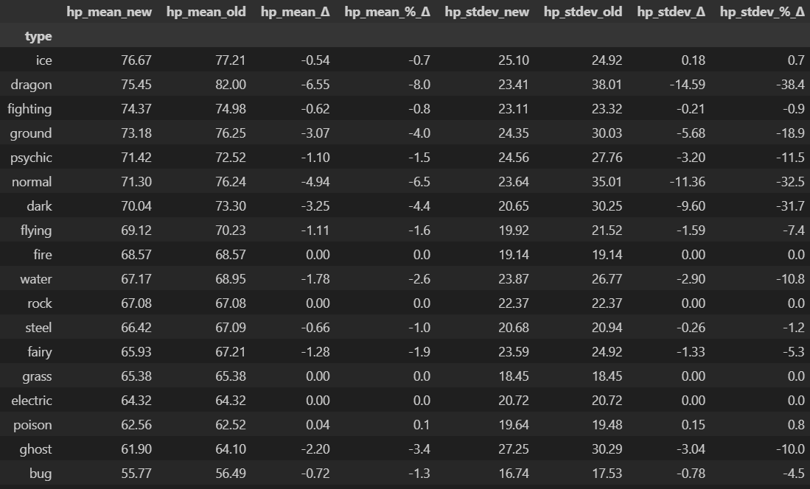

可以看出，各属性的标准差变化比都在10%以内，但是均值和标准差都有所减少，说明去除异常值是有效的。

### 线性回归

尝试建立线性回归模型，根据体重预测宝可梦的HP：

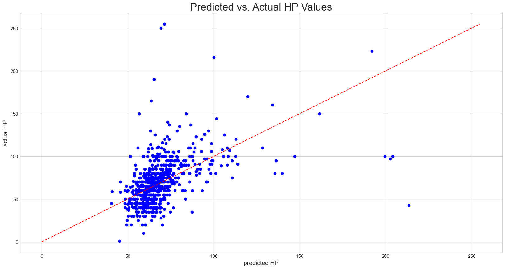

在HP为50到80间，预测相对准确。

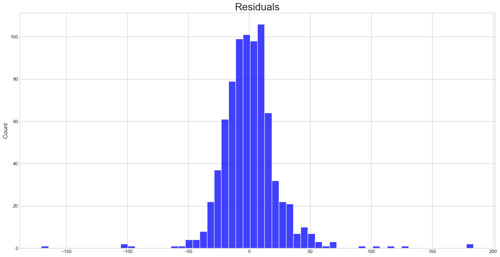

根据残差图，可以看出大部分预测值与实际值的差距不超过20HP。

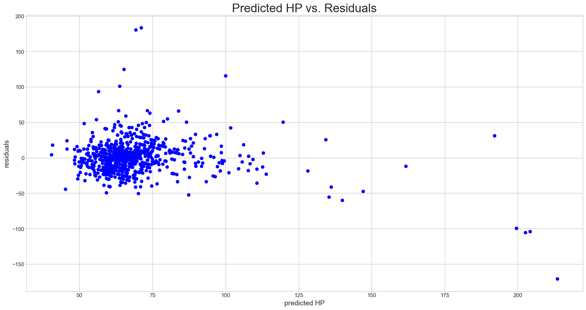

但由于HP的值大多是100以内的，20的残差也是一个相对较大的值了。

### 总结

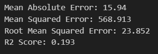

MAE、MSE等误差值都较大，R2 score仅19.3%。

这说明体重-HP的关系并不很紧密，可能需要结合更多数据（如身高，种族值等）才能更准确的预测HP。

用这个模型，可以将体重、HP两项指标任意替换成其他量化指标，进行相关性分析。
