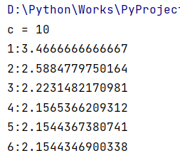

## 作业02 Result

### 1

思路：拆解4, 5, 6三个数，发现`4=2+2, 5=2+3, 6=3+3`时所得乘积最大。因此，更大的数只要遵从“优先拆3”的原则就可以找到最大乘积。注意不能出现1。

### 2

### 3

0表示在原岸，1表示在对岸，empty表示只有人在船上。

### 4

### 5

### 6

对比题6，对于最终结果精度几乎没有影响，对于步数有影响，但牛顿法很快，几乎看不出来。

### 7

### 8

### 9

蒙特卡罗法不准确，故给出多次结果演示。

