# 作业02 Result

## Chapter 3

### 1

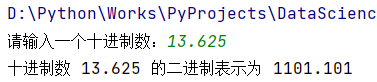

### 2

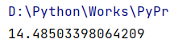

### 3

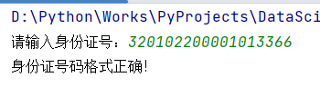

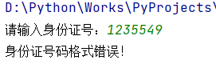

### 4

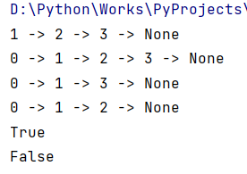

### 5

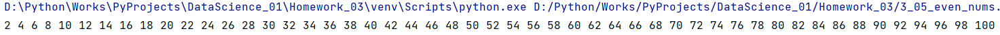

### 6

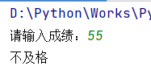

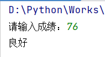

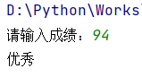

### 7

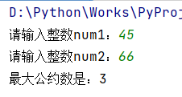

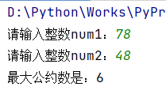

### 8

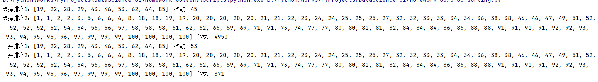

### 9

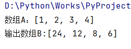

## Chapter 4

### 1

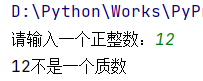

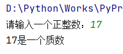

### 2

调用`time`库的`time`函数计时

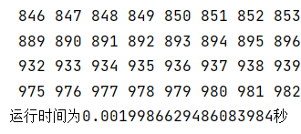

### 3

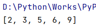

### 4

希尔排序

+ 时间复杂度：平均O(nlogn)，最坏O(n^2)

+ 空间复杂度：O(1)